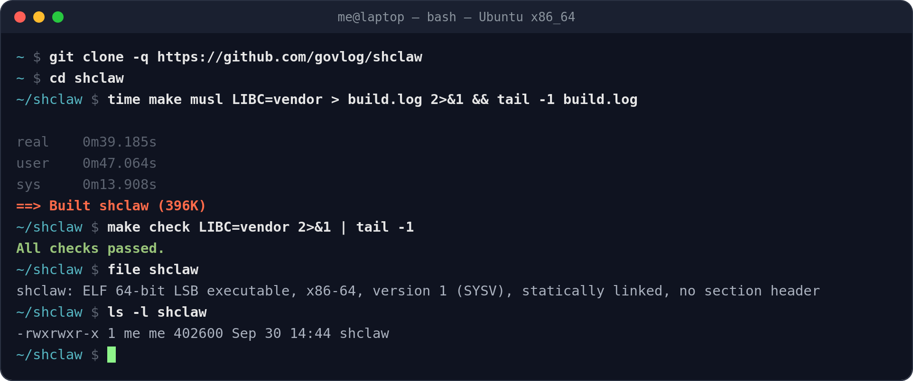

# Building shclaw



One `make` builds a static binary: shclaw, BearSSL, TinyCC and cJSON all compiled in. The first build fetches the vendored sources at pinned revisions (`vendor.sh`), so it needs `git` and `curl`. Every section below was built and tested on the system it names, with the size of the 0.1.3 release.

| System | CPU | libc | Command | Binary |
|--------|-----|------|---------|--------|
| [Linux](#linux-amd64-musl-built-from-source) | amd64 | musl, built from source | `make musl LIBC=vendor` | 396K |
| [Linux](#linux-amd64-system-musl) | amd64 | musl, the system's | `make musl` | 436K |
| [Linux, FreeBSD, NetBSD](#linux-freebsd-netbsd-amd64-cosmopolitan) | amd64 | Cosmopolitan | `make cosmo` | 708K |
| [Linux](#linux-i386) | i386 (Pentium and later) | musl, built from source | `scripts/release-linux-i386.sh` | 388K |
| [Linux](#linux-armv7l-raspberry-pi-32-bit-os) | armv7l | musl, built from source | `make musl LIBC=vendor` | 448K |
| [Linux](#linux-aarch64) | aarch64 | musl, built from source | `make musl LIBC=vendor` | 428K |
| [Linux](#linux-armv6-pi-zero-pi-1) | armv6 | musl, built from source | `make musl LIBC=vendor ...` | 448K |
| [Linux](#linux-riscv64) | riscv64 | musl, built from source | `make musl LIBC=vendor` | 384K |
| [FreeBSD](#freebsd-amd64) | amd64 | FreeBSD libc | `gmake native` | 1.4M |
| [FreeBSD](#freebsd-i386) | i386 | FreeBSD libc | `gmake native` | 1.2M |
| [NetBSD](#netbsd-amd64) | amd64 | NetBSD libc | `gmake native` | 1.3M |
| [NetBSD](#netbsd-i386) | i386 | NetBSD libc | `gmake native` | 1.3M |
| [OpenBSD](#openbsd-amd64) | amd64 | OpenBSD libc | `gmake native` | 736K |
| [OpenBSD](#openbsd-i386) | i386 | OpenBSD libc | `gmake native` | 656K |

The BSD binaries are bigger because their static libcs are: FreeBSD's malloc alone (jemalloc) weighs 73K.

---

## Linux

### Linux amd64, musl built from source

The smallest Linux build. `LIBC=vendor` fetches musl 1.2.6 (with the fixes Alpine applies), builds it with the same size flags as shclaw, then links against it: a C compiler, `make`, `patch` and `curl` are all it needs, whatever the distribution.

```console
$ sudo apt install build-essential git curl     # Debian, Ubuntu
$ sudo apk add build-base git curl              # Alpine
$ sudo dnf install gcc make patch git curl      # Fedora (untested)
$ sudo pacman -S --needed base-devel git curl   # Arch (untested)

$ git clone https://github.com/govlog/shclaw && cd shclaw
$ make musl LIBC=vendor
...
==> Built shclaw (396K)
$ make check LIBC=vendor
...
All checks passed.
```

Tested on Ubuntu 26.04 (gcc 15.2).

### Linux amd64, system musl

The same build with the distribution's `musl-gcc`: quicker the first time (musl is not compiled), 40K bigger.

```console
$ sudo apt install build-essential musl-tools git curl
$ make musl
...
==> Built shclaw (436K)
$ make check
...
All checks passed.
```

Tested on Ubuntu 26.04 (musl 1.2.5).

### Linux, FreeBSD, NetBSD amd64, Cosmopolitan

One file that runs on Linux, FreeBSD and NetBSD (x86_64) without emulation. `make cosmo` fetches the cosmocc 4.0.2 toolchain (checked by SHA-256) and builds on an x86_64 Linux host.

```console
$ sudo apt install build-essential git curl unzip
$ make cosmo
...
==> Built shclaw.com (708K)
    Runs on: Linux, FreeBSD, NetBSD (x86_64)
$ make check-cosmo
...
All checks passed.
```

Tested on Ubuntu 26.04, FreeBSD 15.1 and NetBSD 10.2 (checks and live agents on each). OpenBSD 7.5 and later only accept system calls from their own libc: use the [native build](#openbsd-amd64) there.

### Linux i386

For any 32-bit PC from the Pentium and the AMD K6 on: musl, BearSSL, TinyCC and shclaw all compiled for the i586 (no cmov, SSE or MMX). The script builds in an Alpine i386 container and writes the release archive.

```console
$ sudo apt install docker.io git        # or any Docker
$ scripts/release-linux-i386.sh
...
==> Built shclaw (388.0K)
All checks passed.
$ ls dist/
shclaw-0.1.3-linux-i386.tar.gz
```

Tested in Alpine 3.24 (i386 userland), and on an emulated Pentium: the binary holds no cmov, SSE or MMX instruction and compiles a plugin there.

### Linux armv7l (Raspberry Pi, 32-bit OS)

Build on the Pi itself. Under a 64-bit kernel with a 32-bit userland, run make through `linux32`: TinyCC's configure reads the CPU from `uname -m`.

```console
$ sudo apt install build-essential git curl
$ linux32 make musl LIBC=vendor
...
==> Built shclaw (448K)
$ linux32 make check LIBC=vendor
...
All checks passed.
```

Tested on a Raspberry Pi 3 B+, Raspberry Pi OS 32-bit (Debian 13, gcc 14).

### Linux aarch64

Raspberry Pi with a 64-bit OS, ARM servers.

```console
$ sudo apk add build-base git curl      # or: sudo apt install build-essential git curl
$ make musl LIBC=vendor
...
==> Built shclaw (428.0K)
$ make check LIBC=vendor
...
All checks passed.
```

Tested on a Raspberry Pi 3 B+ (64-bit kernel), Alpine 3.24 aarch64.

### Linux armv6 (Pi Zero, Pi 1)

On a Pi Zero or Pi 1, `make musl LIBC=vendor` works as is, slowly. On a newer Pi, build in an ARMv6 userland, e.g. Alpine armhf (its gcc targets the ARMv6), and tell TinyCC to generate ARMv6 code rather than the board's:

```console
$ apk add build-base git curl
$ T="TCC_CONF=--cpu=armv6l --triplet=arm-linux-gnueabihf"
$ linux32 make musl LIBC=vendor DIST_ARCH=armv6 "$T"
...
==> Built shclaw (448.0K)
$ linux32 make check LIBC=vendor DIST_ARCH=armv6 "$T"
...
All checks passed.
```

Tested in an Alpine 3.24 armhf chroot on a Raspberry Pi 3 B+, and on an emulated ARM1176 (the Pi Zero/1 CPU), where it compiles a plugin.

### Linux riscv64

On a RISC-V board, or in an Alpine container under qemu on a PC (with `qemu-riscv64` registered in binfmt_misc):

```console
$ docker run --rm -it --platform linux/riscv64 alpine:3.24
# apk add build-base git curl
# git clone https://github.com/govlog/shclaw && cd shclaw
# make musl LIBC=vendor
...
==> Built shclaw (384.0K)
# make check LIBC=vendor
...
All checks passed.
```

Tested in Alpine 3.24 under qemu-user.

---

## FreeBSD

The native build uses the system compiler (clang) and libc, with `gmake`. The [Cosmopolitan binary](#linux-freebsd-netbsd-amd64-cosmopolitan) also runs on FreeBSD amd64.

### FreeBSD amd64

```console
# pkg install gmake git curl
$ gmake native
...
==> Built shclaw (1.4M)
$ gmake check-native
...
All checks passed.
```

Tested on FreeBSD 15.1.

### FreeBSD i386

The same commands on an i386 system:

```console
# pkg install gmake git curl
$ gmake native
...
==> Built shclaw (1.2M)
$ gmake check-native
...
All checks passed.
```

Tested on FreeBSD 14.5. The binary also runs on FreeBSD 15.1 amd64, through its 32-bit support.

---

## NetBSD

The native build uses the system compiler (gcc 10) and libc, with `gmake`. The [Cosmopolitan binary](#linux-freebsd-netbsd-amd64-cosmopolitan) also runs on NetBSD amd64, smolBSD included.

### NetBSD amd64

```console
# pkgin install gmake git-base curl
$ gmake native
...
==> Built shclaw (1.3M)
$ gmake check-native
...
All checks passed.
```

Tested on NetBSD 10.2.

### NetBSD i386

```console
# pkgin install gmake git-base curl
$ gmake native
...
==> Built shclaw (1.3M)
$ gmake check-native
...
All checks passed.
```

Tested on NetBSD 10.2.

---

## OpenBSD

The native build uses the system compiler (clang) and libc, with `gmake`. It is the only build for OpenBSD: since 7.5, OpenBSD only accepts system calls from its own libc.

### OpenBSD amd64

```console
# pkg_add gmake git curl
$ gmake native
...
==> Built shclaw (736K)
$ gmake check-native
...
All checks passed.
```

Tested on OpenBSD 7.9.

### OpenBSD i386

```console
# pkg_add gmake git curl
$ gmake native
...
==> Built shclaw (656K)
$ gmake check-native
...
All checks passed.
```

Tested on OpenBSD 7.9.

---

## Hardened builds

Builds are as small as possible by default, without exploit mitigations: shclaw runs code that a model writes, so they would guard little (see [Internals](doc/internals.md#builds)). `SECURE=1` builds them back: stack protector, stack clash probes, FORTIFY, CET on x86, static-PIE (except on the BSDs and Linux i386), full RELRO and separate code pages; Cosmopolitan gets its full runtime, with malloc cookies.

```console
$ make clean
$ make musl LIBC=vendor SECURE=1        # gmake native SECURE=1 on the BSDs
...
==> Built shclaw (424K)
```

The hardened binaries are 5 to 40% bigger. They passed the same checks and live runs on every system above. For the i386 script: `SECURE=1 scripts/release-linux-i386.sh`.

## Install and release archives

```console
$ make install PREFIX=/opt/shclaw       # Linux: builds, then installs the binary and an instance layout
$ make dist                             # dist/shclaw-<version>-<os>-<cpu>.tar.gz for each built binary
```

On the BSDs, `gmake native` then `gmake dist`, or copy `shclaw` by hand. `make docker-image` and `make smolbsd` are described in the [README](README.md#other-ways-to-run).

## Good to know

- **Switching `SECURE`, `LIBC` or `OPT`:** run `make clean` first. The vendored libraries do not track the flags they were built with.
- **Offline machine:** run `./vendor.sh` (and `./vendor.sh musl` or `./vendor.sh cosmo`) on a connected one, then copy the whole tree.
- **`SECURE=1` with a system musl older than 1.2.4:** the packed relocations (DT_RELR) of static-PIE crash at start. Use `LIBC=vendor`, or add `RELR=`.
- **Other options:** `OPT=-Os` (gcc before 12 has no `-Oz`), `EXTRA_CFLAGS=...`, `DIST_ARCH=...` (the CPU in the archive name).
