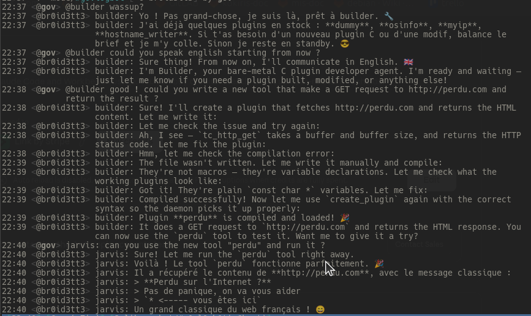

<div align="center">

# shclaw

**Orchestrateur multi-agents IA autonome en C.**
**Un seul binaire statique. Zéro dépendance. Zéro runtime.**

<br>


<br>

*IRC · Multi-LLM · Plugins C à la volée · Planification · Messagerie inter-agents*

<br>



</div>

<br>

*[Read in English](README.md)*

## C'est quoi ce truc

J'en avais marre du bloatware. Chaque "framework d'agents IA" que j'ai regardé (à quelques exceptions près) tirait la moitié de npm ou avait besoin d'un virtualenv Python de la taille d'un petit pays. Je voulais un truc qui *tourne*, point. Pas de runtime, pas d'interpréteur, pas de gestionnaire de paquets, pas de conteneur obligatoire. Juste un binaire et un noyau.

Donc j'ai écrit shclaw : un orchestrateur multi-agents IA en C qui compile en un seul binaire statique de moins de 1Mo. Il parle aux LLMs (Claude, GPT, Ollama), vit sur IRC, planifie ses propres tâches, se souvient de trucs entre les sessions, et — le truc que je trouve vraiment cool — il embarque un compilateur C pour que les agents puissent écrire et compiler leurs propres plugins à la volée. Le tout tourne nativement sur Linux, FreeBSD, NetBSD et OpenBSD à partir du même binaire ELF.

C'est un projet perso. Un jouet. Un truc sur lequel je bidouille parce que le problème est intéressant et parce qu'il y a quelque chose de satisfaisant à faire tenir TLS, HTTP, IRC, du parsing JSON, une boucle agentique et un compilateur C dans 956 kilo-octets — et seulement 518K si on ne cible que Linux.

C'est aussi en grande partie du vibe-coding. J'avais les briques, l'architecture dans la tête, et assez de connaissances en C et en système pour garder le cap — mais le gros du code a été écrit à coups de Claude, Codex, et moi qui gueule sur les deux jusqu'à ce que le binaire linke.

> **Attention.** Shclaw donne à des agents IA autonomes l'accès à des commandes shell, à l'écriture de fichiers et à des appels réseau. L'un d'entre eux peut écrire et compiler du C à la volée. Faites-le tourner sur un truc dont vous vous fichez — une VM, un conteneur, un Raspberry Pi sur un VLAN.

```
~6000 lignes de C · ~518K statique (musl) · ~956K multi-plateforme (cosmo) · 4 systèmes d'exploitation
```

---

## Comment ça marche

```
    agents          hub · recherche · builder (1 pthread chacun)
      │                     │
      ▼                     ▼
  event loop ◄──── poll() sur IRC fd + unix socket fd
      │               timer 5s : planificateur, inbox, scan plugins
      │
      ├── IRC (TLS 6697)        ← le proprio parle aux agents
      ├── unix socket           ← TUI / CLI
      ├── planificateur + inbox ← tâches planifiées, messages inter-agents
      └── scanner plugins       ← recompile les .c modifiés via TCC
```

Chaque agent tourne dans son propre pthread. Un déclencheur (mention IRC, tâche planifiée, message inter-agent, commande CLI) crée un thread de session. L'agent construit un prompt système à partir de sa personnalité, sa mémoire, son planning et la liste de ses pairs, puis entre dans une boucle de conversation avec le fournisseur LLM. Quand le LLM renvoie des appels d'outils, il les exécute et réinjecte les résultats. Quand il renvoie du texte, la réponse part sur IRC ou le socket TUI. Les sessions ont une limite de tours configurable (défaut 100) et un cooldown de 5 secondes entre les sessions d'un même agent.

La boucle d'événements est un seul appel `poll()` qui surveille le socket IRC et le socket Unix, avec un timer de 5 secondes pour la livraison des messages, la planification des tâches et le scan du répertoire plugins.

### Rôles des agents

Chaque agent est défini par un fichier INI dans `etc/agents/`. Deux flags contrôlent des comportements spéciaux :

- **`hub = true`** — Cet agent est le destinataire par défaut. Tout message IRC qui ne commence pas par un `@mention` est routé vers le hub. Il ne doit y en avoir qu'un — c'est "l'accueil" qui gère la conversation générale et décide quand déléguer aux spécialistes via `send_message`. Le hub n'a pas besoin d'un gros modèle — un truc comme `qwen3.5:9b` via Ollama ou `gpt-4.1-nano` marche bien pour le routage et la conversation courante.
- **`builder = true`** — Cet agent a accès à l'outil `create_plugin`. Il peut écrire du code source C et le faire compiler par le daemon en outil live via TCC. On ne veut pas que tous les agents aient ça — c'est puissant et dangereux, donc on le donne à un agent dédié avec un prompt système qui connaît les contraintes de l'API plugin (`-nostdlib`, `tc_plugin.h` uniquement, pas de libc). **Il faut un modèle costaud pour ça** (Claude Sonnet/Opus, GPT-4.1) — les petits modèles vont halluciner des headers libc ou produire du code qui ne compile pas. Utilisez le template `builder.ini.example`, il contient assez d'instructions dans `system_prompt_extra` pour garder le modèle sur les rails.

Un setup typique : un agent hub (généraliste, modèle pas cher/local), un agent recherche (analyse, modèle standard), et un agent builder (création de plugins, modèle costaud). Ils se coordonnent via `send_message` — des boîtes aux lettres fichier dans `data/messages/<agent>/`, consultées toutes les 5 secondes par le daemon.

Pour l'instant, les seuls canaux de communication sont IRC et le socket Unix (TUI/CLI). Je prévois d'ajouter d'autres canaux prochainement.

### Mémoire à deux étages

Chaque agent a deux mécanismes de persistance indépendants :

**Mémoire** (`data/<agent>/memory/memory.jsonl`) — Un log JSONL en append-only. Quand un agent appelle `remember`, un objet JSON est ajouté avec le contenu, une catégorie (`general`, `project`, `person`, `event`, `error`), un score d'importance (1-10), des tags, et un timestamp. Quand l'agent appelle `recall`, il cherche par correspondance de mots-clés et de tags. Les N derniers souvenirs sont injectés dans le prompt système au début de chaque session, pour que l'agent ait du contexte sur les interactions passées.

**Faits** (`data/<agent>/memory/facts.json`) — Un objet JSON plat clé-valeur. Quand un agent appelle `set_fact`, il stocke une association permanente (`timezone` = `Europe/Paris`, `owner_name` = `Alice`). Les faits sont toujours inclus dans le prompt système — c'est le "savoir dur" de l'agent qui n'est jamais élagué. Contrairement aux souvenirs qui s'accumulent et qui devront éventuellement être taillés, les faits sont censés être peu nombreux, précis et permanents.

L'idée : les souvenirs c'est pour le rappel épisodique ("mardi dernier le serveur a eu un souci de disque"), les faits c'est pour l'identité et la configuration ("le proprio parle français", "le serveur de prod c'est 10.0.1.5").

### Le tour de passe-passe TCC

La pièce la plus inhabituelle de shclaw, c'est qu'il embarque [TinyCC](https://bellard.org/tcc/) (libtcc) — le compilateur C de Fabrice Bellard — comme bibliothèque. Quand un agent veut créer un nouvel outil, il écrit du code source C. Le daemon le passe à `tcc_compile_string()`, le reloge en mémoire avec `tcc_relocate()`, et résout le point d'entrée avec `tcc_get_symbol()`. Aucun fichier `.so` n'est jamais écrit sur le disque. Le code compilé vit dans l'espace d'adressage du processus et est appelable immédiatement.

Les plugins tournent en mode `-nostdlib` : pas de libc, pas de headers système. Le daemon injecte un ensemble de fonctions sélectionnées (`tc_malloc`, `tc_http_get`, `tc_json_parse`, etc.) via `tcc_add_symbol()` avant la compilation. C'est à la fois un sandbox (les plugins ne peuvent pas appeler de fonctions libc arbitraires) et une commodité (les plugins ont du HTTP avec TLS gratuitement sans rien linker).

Au redémarrage, `plugin_scan()` recompile tous les fichiers `.c` dans `plugins/`. Les fichiers modifiés sont détectés par mtime et recompilés à la volée toutes les 5 secondes.

### Comment un ELF tourne sur quatre noyaux

Le build musl produit un binaire statique Linux standard (~518K, durci avec static-PIE, RELRO, NX, stack protector, FORTIFY_SOURCE). Ça marche sur x86_64, aarch64 et armv7l — la détection d'architecture est automatique. J'ai testé sur un Raspberry Pi 3B+ en Raspbian 32 bits et ça tourne nickel (static-pie est désactivé sur armv7l à cause de soucis musl/noyau, ça retombe sur du `-static` classique).

Le build Cosmopolitan est plus intéressant. [Cosmopolitan Libc](https://justine.lol/cosmopolitan/) de Justine Tunney fournit une libc qui cible plusieurs systèmes d'exploitation à partir du même binaire. On compile avec `x86_64-unknown-cosmo-cc` (pas le `cosmocc` fat — TinyCC génère des relocations ELF x86_64, donc on a besoin de la toolchain spécifique x86_64). L'étape `assimilate` convertit le format APE (Actually Portable Executable) en ELF natif que le noyau charge directement — pas de trampoline shell, pas d'interpréteur.

Le résultat : un ELF de 956K qui tourne tel quel sur Linux, NetBSD, FreeBSD et OpenBSD. Même binaire, quatre noyaux. Par flemme je n'ai testé que Linux et NetBSD pour l'instant — FreeBSD et OpenBSD c'est sur la liste, j'y viendrai.

Faire fonctionner TCC sous Cosmopolitan a nécessité trois patches (`patches/tcc-cosmo.patch`) :

1. **Guard NULL dans `tcc_split_path()`** — Cosmopolitan ne définit pas `tcc_lib_path` par défaut ; le déréférencer fait crasher. Fix : fallback sur `"."`.
2. **`strcpy` remplacé par `memcpy` pour les noms PLT** — le `strcpy` de Cosmopolitan utilise des instructions SSE (`memrchr16_sse`) qui plantent sur certains petits buffers alignés sur la pile. Celui-là était fun à traquer.
3. **Ignorer les noms de section vides** — `tcc_add_linker_symbols()` génère des symboles en double pour les sections dont le nom est vide après suppression du point.

### Ce qu'il y a dedans

| Composant | Projet | Rôle |
|-----------|--------|------|
| TLS 1.2 | [BearSSL](https://bearssl.org/) par Thomas Pornin | HTTPS vers les APIs LLM, IRC sur TLS. Pas d'allocation dynamique, pas de dépendances. |
| Compilateur C | [TinyCC](https://bellard.org/tcc/) par Fabrice Bellard | Compilation de plugins en mémoire. libtcc embarqué comme bibliothèque. |
| JSON | [cJSON](https://github.com/DaveGamble/cJSON) par Dave Gamble | Parse/génère toutes les payloads des APIs LLM. Un seul fichier, ~1700 lignes. |
| Libc | [musl](https://musl.libc.org/) ou [Cosmopolitan](https://justine.lol/cosmopolitan/) | Linkage statique. musl pour Linux, Cosmopolitan pour le multi-plateforme. |

Tout le reste (client HTTP/1.1, client IRC, parseur INI, TUI ANSI, planificateur, système de mémoire, scanner de plugins) est écrit from scratch — environ 6000 lignes de C réparties dans 20 fichiers source.

---

## Pour commencer

### Dépendances

Debian/Ubuntu :
```bash
sudo apt install build-essential musl-tools git
```

C'est tout. Le Makefile récupère automatiquement les sources vendorisées ([BearSSL](https://bearssl.org/), [TinyCC](https://bellard.org/tcc/), [cJSON](https://github.com/DaveGamble/cJSON)) au premier build via `vendor.sh`.

Pour le build Cosmopolitan, la toolchain est aussi récupérée automatiquement (~40Mo, cachée dans `vendor/cosmo/`).

### Compiler

```bash
git clone https://github.com/govlog/shclaw.git && cd shclaw

# Linux uniquement (musl-gcc, statique, durci)
make musl          # => ./shclaw (~518K)

# Multi-plateforme (Cosmopolitan, x86_64)
make cosmo         # => ./shclaw.com (~956K, tourne sur Linux/NetBSD/FreeBSD/OpenBSD)

make clean         # tout nettoyer
```

### Configurer

Shclaw utilise des fichiers INI plats. Pas de YAML, pas de JSON config, pas de variables d'environnement.

```bash
mkdir -p etc/agents
```

**`etc/config.ini`** — configuration globale (fournisseurs, tiers, IRC, chemins) :

```ini
[daemon]
data_dir = ./data
log_dir  = ./logs

[provider.anthropic]
type    = anthropic
api_key = sk-ant-api03-VOTRE-CLE-ICI

[provider.ollama]
type     = openai
base_url = http://localhost:11434
api_key  =

[tiers]
simple   = anthropic/claude-haiku-4-5-20251001
standard = anthropic/claude-sonnet-4-6
complex  = anthropic/claude-opus-4-6
local    = ollama/llama3

# Optionnel — supprimez cette section pour tourner sans IRC
[irc]
server      = irc.libera.chat
port        = 6697
nick        = monbot
channel     = #mon-channel
channel_key = maclesecrete
owner       = monnick
```

**`etc/agents/jarvis.ini`** — un fichier par agent :

```ini
[agent]
name       = jarvis
model      = simple
hub        = true
max_turns  = 30
personality = Tu es Jarvis, un assistant efficace et direct.

[objectives]
1 = Répondre aux demandes rapidement
2 = Garder en mémoire les tâches importantes
```

Voir `etc/config.ini.example` et `etc/agents/*.ini.example` pour la référence complète.

### Lancer

#### Bare metal

```bash
./shclaw                  # premier plan
./shclaw -d               # démoniser (fork + setsid)
./shclaw tui              # interface chat terminal (se connecte au daemon)
./shclaw tui oracle       # parler à un agent spécifique
./shclaw msg jarvis "yo"  # message fire-and-forget
./shclaw status           # état des agents (JSON)
./shclaw stop             # arrêt propre
```

Le daemon cherche `etc/config.ini` dans le répertoire courant. Changer avec `--workdir=/chemin/vers/instance`.

#### Docker

```bash
# Construire l'image
make docker-image     # => shclaw:latest (~11Mo Alpine)

# Préparer un répertoire d'instance
mkdir -p my-instance/{etc/agents,data,logs,plugins}
# copier et éditer config.ini + fichiers .ini des agents dans my-instance/etc/

# Lancer
docker run -v ./my-instance:/app/instance shclaw
```

#### smolBSD (microVM NetBSD)

[smolBSD](https://github.com/NetBSDfr/smolBSD) par iMiL fait booter une VM NetBSD minimale en ~20ms via QEMU. Le binaire Cosmopolitan de shclaw tourne nativement dessus.

```bash
# Récupérer smolBSD (première fois)
./vendor.sh smolbsd

# Construire l'image microVM (nécessite le binaire cosmo)
make smolbsd AGENT_DIR=/chemin/vers/instance

# Booter
cd vendor/smolbsd
./startnb.sh -k kernels/netbsd-SMOL -i images/shclaw-amd64.img -w /chemin/vers/instance
```

Le répertoire d'instance est monté via 9P virtfs sur `/mnt`. La VM boote, monte le répertoire hôte, et lance shclaw en environ une seconde.

#### Installation système

```bash
sudo make install PREFIX=/opt/shclaw

# Le préfixe est intégré au binaire — il cherche toujours là-bas pour la config
/opt/shclaw/bin/shclaw
```

Crée `$PREFIX/{bin,etc,etc/agents,plugins,include,data,logs}`.

---

## Outils des agents

Les agents disposent de 15 outils intégrés :

| Outil | Ce qu'il fait |
|-------|---------------|
| `exec` | Exécuter une commande shell (fork+exec, capture pipe, timeout, kill pgid) |
| `read_file` | Lire le contenu d'un fichier (avec offset et limite) |
| `write_file` | Écrire/ajouter à un fichier (atomique : tmp + rename) |
| `schedule_task` | Tâche ponctuelle à une heure ISO 8601 |
| `schedule_recurring` | Tâche récurrente (30min / horaire / 6h / 12h / quotidien / hebdo) |
| `list_tasks` | Lister les tâches planifiées |
| `update_task` | Modifier une tâche existante |
| `cancel_task` | Annuler une tâche par ID |
| `remember` | Sauvegarder un souvenir (tagué, catégorisé, score d'importance) |
| `recall` | Chercher dans les souvenirs par mot-clé |
| `set_fact` | Stocker un fait clé-valeur permanent |
| `get_fact` | Récupérer un fait |
| `send_message` | Envoyer un message à un autre agent, au propriétaire (via IRC), ou en broadcast |
| `list_agents` | Lister les agents actifs |
| `create_plugin` | Écrire du C + compiler via TCC (agents builder uniquement) |

Les plugins écrits par les agents deviennent des outils disponibles pour tous les agents immédiatement.

---

## API Plugin

Les plugins sont des fichiers `.c` unitaires. Ils font `#include "tc_plugin.h"` et exportent trois symboles :

```c
#include "tc_plugin.h"

const char *TC_PLUGIN_NAME = "weather";
const char *TC_PLUGIN_DESC = "Récupérer la météo pour une ville";

const char *tc_execute(const char *input_json) {
    void *json = tc_json_parse(input_json);
    const char *city = tc_json_string(tc_json_get(json, "city"));

    char url[256];
    tc_snprintf(url, sizeof(url), "https://wttr.in/%s?format=3", city);

    static char result[512];
    int status = tc_http_get(url, result, sizeof(result));
    tc_json_free(json);

    return (status == 200) ? result : "erreur";
}
```

Fonctions disponibles (injectées par le daemon à la compilation) :

| Catégorie | Fonctions |
|-----------|-----------|
| Mémoire | `tc_malloc`, `tc_free` |
| Chaînes | `tc_strlen`, `tc_strcmp`, `tc_strncmp`, `tc_strcpy`, `tc_strncpy`, `tc_snprintf`, `tc_memcpy`, `tc_memset` |
| Fichiers | `tc_read_file`, `tc_write_file` |
| HTTP | `tc_http_get`, `tc_http_post`, `tc_http_post_json`, `tc_http_header` |
| JSON | `tc_json_parse`, `tc_json_free`, `tc_json_print`, `tc_json_get`, `tc_json_index`, `tc_json_array_size`, `tc_json_string` |
| Système | `tc_gethostname` |
| Logging | `tc_log` |

Les appels HTTP utilisent la stack BearSSL du daemon — les plugins ont HTTPS gratuitement.

---

## IRC

Connexion unique, un seul pseudo, un seul canal. Les agents sont multiplexés sur la même connexion.

```
vous>   hey, vérifie la charge du serveur        => routé vers l'agent hub
vous>   @oracle analyse ce fichier de log         => routé vers oracle
vous>   @oracle X @jarvis Y                       => fan-out vers les deux
vous>   @all status                               => broadcast

bot>    jarvis: CPU à 12%, tout va bien.
bot>    oracle: Je vois 3 anomalies dans le log...
```

TLS est automatique sur le port 6697 (BearSSL). Si aucun canal/clé n'est configuré, shclaw en génère des aléatoires — les récupérer avec `shclaw irc-info`.

---

## État de la documentation

C'est le projet perso d'une seule personne. Le code fait office de documentation pour l'instant. Si le projet vous intéresse, que vous voulez le faire tourner ou contribuer, n'hésitez pas à ouvrir une issue — je suis ouvert à écrire de meilleure doc pour les parties qui intéressent les gens.

Les coups de main sont les bienvenus :
- Packaging pour d'autres distros (Alpine, Arch, NixOS)
- Tests ARM64 sur NetBSD/FreeBSD
- Plus d'exemples de plugins
- Documentation en général

---

## Crédits

Ce projet n'existerait pas sans le travail de :

- **[Justine Tunney](https://justine.lol/)** — [Cosmopolitan Libc](https://justine.lol/cosmopolitan/) et le format APE. L'idée qu'un seul binaire puisse tourner sur quatre systèmes d'exploitation, pour de vrai, sans émulation.
- **[Fabrice Bellard](https://bellard.org/)** — [TinyCC](https://bellard.org/tcc/). Un compilateur C complet assez petit pour être embarqué comme bibliothèque. C'est ce qui rend la compilation de plugins à la volée possible.
- **[Thomas Pornin](https://www.bearssl.org/)** — [BearSSL](https://bearssl.org/). Une implémentation TLS conçue pour l'embarqué : petite, sans allocation, crypto en temps constant. C'est grâce à ça qu'un binaire de moins de 1Mo peut parler HTTPS.
- **[Dave Gamble](https://github.com/DaveGamble/cJSON)** — [cJSON](https://github.com/DaveGamble/cJSON). Parseur JSON en un seul fichier. Simple, fiable, gère tout ce que les APIs LLM lui balancent.
- **[iMil](https://x.com/iMilnb)** — [smolBSD](https://github.com/NetBSDfr/smolBSD). Framework de microVM NetBSD minimale. Booter un BSD complet en 60ms.

## Licence

MIT. Voir [LICENSE](LICENSE).

Les bibliothèques vendorisées ont leurs propres licences :

| Bibliothèque | Licence |
|--------------|---------|
| BearSSL | MIT |
| cJSON | MIT |
| TinyCC | LGPL-2.1 |
| musl libc | MIT |
| Cosmopolitan Libc | ISC |

Voir [NOTICE](NOTICE) pour les détails.
