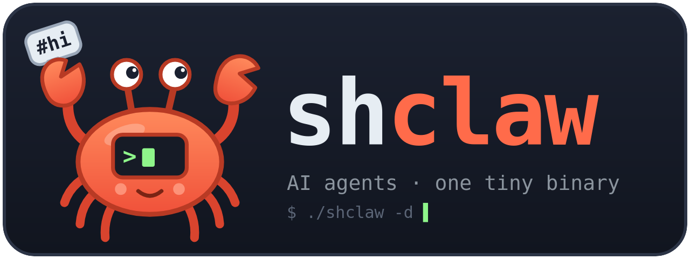
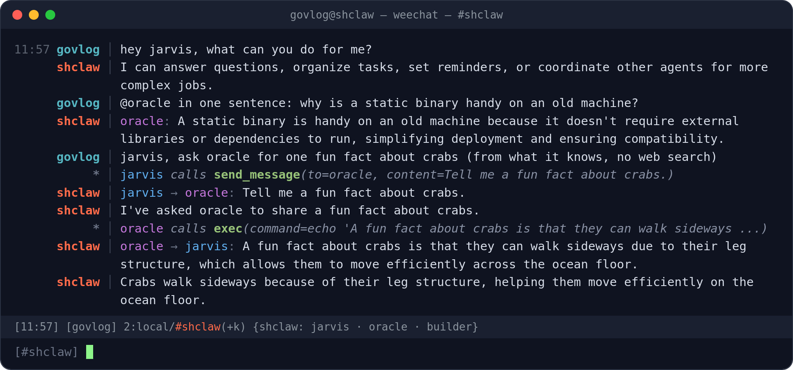
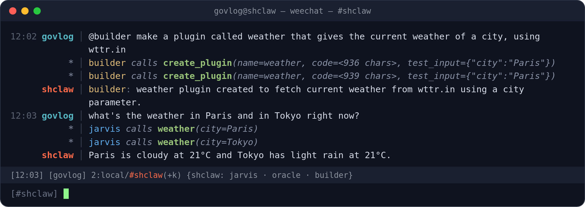
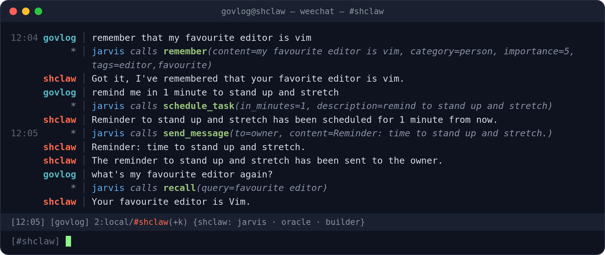

<div align="center">



**Self-contained multi-agent AI orchestrator in C.**
**Single static binary. No dependencies. No runtime.**

🦀 **From a 1993 Pentium to a RISC-V board: AI agents on Linux and three BSDs, 13 builds.**


*IRC · Multi-LLM · Runtime C plugins · Scheduling · Inter-agent messaging*

</div>

<br>

shclaw runs a team of AI agents from one static binary under 1 MB. The agents run on any model that calls tools: Claude, GPT-6, DeepSeek, or any OpenAI- or Anthropic-compatible endpoint (Ollama, llama.cpp...). They live on IRC, schedule their own tasks, remember things between sessions, and write their own tools in C.

- **Static binaries, many systems.** The [Cosmopolitan](https://justine.lol/cosmopolitan/) build is one file for Linux, FreeBSD and NetBSD. The musl build is a static Linux binary for 64-bit and 32-bit PCs and ARM boards; OpenBSD gets a native static build.
- **Tools written at runtime.** An agent writes a C plugin; the embedded [TinyCC](https://bellard.org/tcc/) compiles it in memory and every agent can call it at once.
- **Made for small models.** The harness catches the usual mistakes of models like `gpt-4.1-nano` or `qwen3.5:9b`.
- **Batteries included.** TLS, HTTP, IRC, JSON, scheduler, memory and a terminal UI are all in the binary.

> **Fair warning.** Agents run shell commands, read and write files, call the network and compile C. Run shclaw somewhere you don't care about: a VM, a container, a Pi on a VLAN.

---

## In action

Real sessions on a local IRC server with `gpt-4.1-nano`, recorded and rendered by `scripts/demo/`.

**Chat and delegation.** Without a mention, the hub answers; `@oracle` goes to a specialist; jarvis delegates on its own with `send_message`.



**The builder writes a tool.** It writes a C plugin, test-runs it, and jarvis calls the new tool right away.



**Memory and reminders.** Facts are remembered between sessions, and a scheduled task comes back on time.



---

## Quick start

### Build

```bash
sudo apt install build-essential musl-tools git curl  # Debian/Ubuntu
git clone https://github.com/govlog/shclaw.git && cd shclaw

make musl    # static Linux binary, ~430K (LIBC=vendor: ~390K, musl built from source)
make cosmo   # one binary for Linux, FreeBSD, NetBSD (x86_64), ~710K
gmake native # FreeBSD, NetBSD or OpenBSD, with the system compiler
```

Builds are as small as possible by default, without exploit mitigations: this agent runs code that a model writes, so they would guard little. `SECURE=1` builds them back (stack protector, FORTIFY, static-PIE, RELRO...): see [Internals](doc/internals.md#builds).

The first build fetches the vendored libraries at pinned revisions. **[BUILD.md](BUILD.md)** gives the dependencies and commands for every system, CPU and libc. Prebuilt archives for each platform are on the [Releases](https://github.com/govlog/shclaw/releases) page.

### Configure

An instance is a directory with `etc/config.ini` and one file per agent in `etc/agents/`.

**`etc/config.ini`** holds the providers, the model tiers and IRC:

```ini
[daemon]
data_dir = ./data
log_dir  = ./logs

[provider.openai]
type             = openai
api_key          = sk-YOUR-KEY-HERE
reasoning_effort = none   ; gpt-6-* accept function tools only with none

[provider.deepseek]
type     = openai
base_url = https://api.deepseek.com
api_key  = sk-YOUR-KEY-HERE

[provider.anthropic]
type    = anthropic
api_key = sk-ant-api03-YOUR-KEY-HERE

[provider.ollama]
type     = openai
base_url = http://localhost:11434
api_key  =
timeout  = 900      ; seconds of silence allowed (slow local models)

[tiers]
simple   = openai/gpt-6-luna
standard = deepseek/deepseek-flash
complex  = anthropic/claude-opus-5-5
local    = ollama/qwen3.5:9b

# Optional: without [irc], use the TUI and the CLI
[irc]
server      = irc.libera.chat
port        = 6697
nick        = mybot
channel     = #my-channel
channel_key = mysecretkey
owner       = mynick
```

**`etc/agents/jarvis.ini`** defines one agent:

```ini
[agent]
name       = jarvis
model      = simple
hub        = true
max_turns  = 30
personality = You are Jarvis, a helpful and efficient assistant.

[objectives]
1 = Answer questions quickly and efficiently
2 = Keep track of important tasks in memory
```

More examples: `etc/config.ini.example` and `etc/agents/*.ini.example`.

Optional keys:

| Section | Key | Default | Meaning |
|---------|-----|---------|---------|
| `[provider.*]` | `base_url` | the official API | Any compatible server, for `type = openai` (`/v1/chat/completions`) or `type = anthropic` (`/v1/messages`), with or without `/v1`. Prompt caching parameters only go to the official APIs |
| `[provider.*]` | `max_tokens` | 16000 (official APIs), 4096 (others) | Output limit per model call |
| `[provider.*]` | `timeout` | 600 | Seconds without data before a model call fails |
| `[provider.*]` | `reasoning_effort` | not sent | Sent as is to OpenAI-compatible APIs. `gpt-6-*` models need `none`: without it, they refuse function tools |
| `[daemon]` | `conversation_timeout` | 15 | Minutes of silence that close the conversation with the owner. 0: each owner message starts afresh |
| `[agent]` | `history_budget` | 0 (off) | Characters of tool output kept in a session. Past it, the oldest outputs are shortened to half the budget. It also caps the conversation kept between two owner messages (default 64K characters): past it, the oldest exchanges go, the first one stays. For small context windows; the shortening is for OpenAI-compatible providers only |

**With Ollama**, set on the server:

- `OLLAMA_CONTEXT_LENGTH=16384` or more. With the default, the system prompt and the tool list do not fit, and the model silently loses its instructions.
- `OLLAMA_NUM_PARALLEL` to at least the number of agents on the model, so each agent keeps its prompt in the server cache between sessions. Each slot costs one context of memory.
- `OLLAMA_KEEP_ALIVE` longer than the gaps between sessions (default: 5m).

### Run

```bash
./shclaw                  # foreground
./shclaw -d               # daemonize
./shclaw tui              # terminal chat UI
./shclaw tui oracle       # talk to a specific agent
./shclaw msg jarvis "hi"  # send a message
./shclaw status           # agent status (JSON)
./shclaw stop             # graceful shutdown
```

shclaw looks for `etc/config.ini` in the current directory; `--workdir=/path/to/instance` points elsewhere. Plugins also need `include/tc_plugin.h` and `plugins/_template.c` in the instance: `make install` copies them.

---

## How it works

- **Sessions.** One event loop watches IRC and a Unix socket (CLI and TUI). Each trigger starts a session in its own thread: an owner message, a due task, a message from another agent. An agent runs one session at a time, with its personality, its memory and its tools. Talking to the owner opens a conversation: while it goes on, each session that answers the owner continues the agent's own history, tool results included, and learns what the other agents said since. After `conversation_timeout` minutes of silence the next message starts afresh.
- **Agents.** Each agent is an INI file in `etc/agents/`. Two flags give a role:
  - `hub = true`: gets the IRC messages without an `@mention`, chats and delegates to specialists. A small model is enough (`qwen3.5:9b`, `gpt-4.1-nano`).
  - `builder = true`: writes C plugins with `create_plugin`. It sees only 4 tools and gets the plugin template, with every available function, in its prompt. Compile errors come back with the faulty source lines, and a test run shows the output and each HTTP call. Code that the model prints as text is compiled too. With this loop, even `gpt-4.1-nano` writes a working weather plugin.

  A typical setup: a hub on a cheap or local model, a research agent on a standard model, a builder on a capable one.
- **Messaging.** `send_message` drops mail into file inboxes. When an agent answers a request in plain text, shclaw sends the answer back to the agent that asked, so a small model that forgets `send_message` still closes the loop.
- **Memory.** Each agent keeps two stores, and gets both at the start of each session:
  - *memories*: an append-only log with categories, importance scores and tags, searched with `recall`. The recent ones are given.
  - *facts*: a few permanent key-value pairs, such as `timezone = Europe/Paris`. Never pruned.
- **Plugins.** TinyCC compiles each plugin in memory: no `.so` on disk. A plugin has no libc; it calls `tc_*` functions for HTTP+TLS, JSON and files. Each call runs in a forked child with a timeout, so a crash or a hang fails that call only. This is not a sandbox: a plugin is native code with the daemon's rights. See [doc/plugin-api.md](doc/plugin-api.md).

---

## Agent tools

16 built-in tools. Plugins that agents create become tools for every agent at once.

| Tool | What it does |
|------|-------------|
| `exec` | Run a shell command |
| `read_file` | Read a file |
| `write_file` | Write or append to a file |
| `schedule_task` | One-shot task, in N minutes or at a given time |
| `schedule_recurring` | Recurring task |
| `list_tasks` | List scheduled tasks |
| `update_task` | Modify a task |
| `cancel_task` | Cancel a task |
| `remember` | Save a memory |
| `recall` | Search memories |
| `set_fact` | Store a key-value fact |
| `get_fact` | Retrieve a fact |
| `send_message` | Message an agent, the owner, or everyone |
| `list_agents` | List running agents |
| `create_plugin` | Write, compile and test-run a C plugin (builder only) |
| `clear_memory` | Clear memories and/or facts |

---

## IRC

One connection, one nick, one channel, shared by all agents.

```
you>    hey, check the server load              => routed to hub
you>    @oracle analyze this log file           => routed to oracle
you>    oracle: analyze this log file           => same ("oracle," too)
you>    @oracle X @jarvis Y                     => both get their part
you>    @all status                             => broadcast

bot>    jarvis: CPU is at 12%, all good.
bot>    oracle: I see 3 anomalies in the log...
```

---

## Other ways to run

**Docker**

```bash
make docker-image
docker run --user "$(id -u):$(id -g)" -v "$PWD/my-instance:/app/instance" shclaw
```

`--user` lets the daemon write `data/` and `logs/` into your instance directory.

**smolBSD**, a NetBSD microVM that boots in about 60 ms, runs the Cosmopolitan binary:

```bash
make cosmo
make smolbsd AGENT_DIR=/path/to/instance
cd vendor/smolbsd && ./smoler.sh run shclaw-amd64:latest -w /path/to/instance
```

The instance directory is shared over 9P and mounted on `/mnt`; Ctrl-A X stops the VM. Needs `bmake`, `qemu-system-x86_64` (KVM), `bsdtar`, `sgdisk`, and `sudo` or `doas`.

---

## Platforms

| System | CPU | Build | Tested |
|--------|-----|-------|--------|
| Linux | x86_64 | `make musl LIBC=vendor`, `make cosmo` | checks, live agents and plugins |
| Linux | i386 (32-bit PC) | `scripts/release-linux-i386.sh` | checks, live agents and plugins |
| Linux | armv6 (Pi Zero, Pi 1) | `make musl LIBC=vendor DIST_ARCH=armv6 TCC_CONF=...`, see [BUILD.md](BUILD.md#linux-armv6-pi-zero-pi-1) | checks, live agents and plugins, also on an emulated ARM1176 |
| Linux | armv7l (Raspberry Pi, 32-bit OS) | `make musl LIBC=vendor` | checks, live agents and plugins |
| Linux | aarch64 (Raspberry Pi, 64-bit kernel) | `make musl LIBC=vendor` | checks, live agents and plugins |
| Linux | riscv64 | `make musl LIBC=vendor` | checks, live agents and plugins, under qemu |
| FreeBSD 15.1 | x86_64 | `make cosmo`, `gmake native` | checks, live agents and plugins |
| FreeBSD 14.5 | i386 | `gmake native` | checks, live agents and plugins |
| NetBSD 10.2, 11.99 (smolBSD) | x86_64 | `make cosmo`, `gmake native` (10.2) | checks, live agents and plugins |
| NetBSD 10.2 | i386 | `gmake native` | checks, live agents and plugins |
| OpenBSD 7.9 | x86_64, i386 | `gmake native` | checks, live agents and plugins |

Cosmopolitan binaries cannot run on OpenBSD 7.5 and later, which only accept system calls from the system libc: use the native build there. The FreeBSD i386 binary also runs on FreeBSD 15 amd64, through its 32-bit support.

Release archives come from `make dist`. The Linux ones link the pinned musl built from source (`LIBC=vendor`). The i386 one comes from `scripts/release-linux-i386.sh` (Docker): it builds everything, musl included, for the i586 (no cmov, SSE or MMX), so the binary runs on any 32-bit PC from the Pentium and the AMD K6 on.

---

## Development

```bash
make check         # tests/check.c: HTTP, IRC, plugins, prompts, dates, tool arguments...
make check-cosmo   # the same checks, built with cosmocc
```

- [Build](BUILD.md): every system, CPU and libc, step by step
- [Plugin API](doc/plugin-api.md): writing plugins, the `tc_*` functions
- [Internals](doc/internals.md): event loop, harness, prompt caching, plugin compilation, builds

---

## Credits

- **[Justine Tunney](https://justine.lol/)**: [Cosmopolitan Libc](https://justine.lol/cosmopolitan/). One binary, four operating systems.
- **[Fabrice Bellard](https://bellard.org/)**: [TinyCC](https://bellard.org/tcc/). A C compiler small enough to embed as a library.
- **[Thomas Pornin](https://www.bearssl.org/)**: [BearSSL](https://bearssl.org/). TLS for embedded systems.
- **[Dave Gamble](https://github.com/DaveGamble/cJSON)**: [cJSON](https://github.com/DaveGamble/cJSON). Single-file JSON parser.
- **[iMil](https://x.com/iMilnb)**: [smolBSD](https://github.com/NetBSDfr/smolBSD). NetBSD microVMs.

## License

MIT. See [LICENSE](LICENSE).

Vendored libraries: BearSSL (MIT), cJSON (MIT), TinyCC (LGPL-2.1), musl (MIT), Cosmopolitan (ISC). See [NOTICE](NOTICE).
